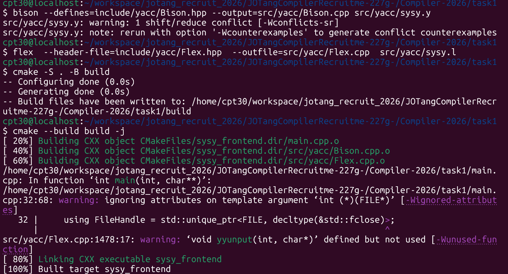
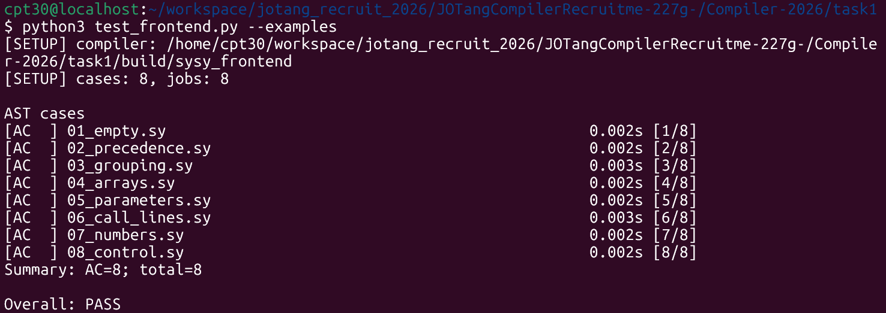
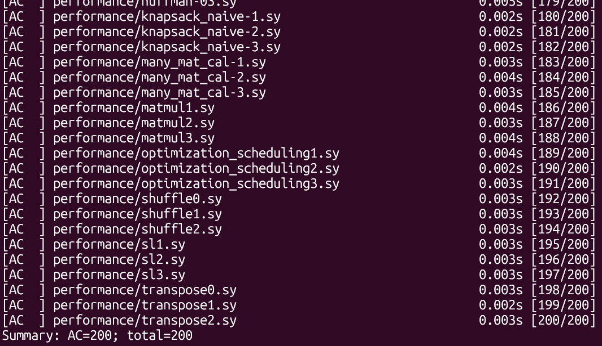

# Task1 前端实现报告

---

## 一、可复现的构建命令

### 1.1 生成与构建

```bash
mkdir -p include/yacc src/yacc

bison --defines=include/yacc/Bison.hpp --output=src/yacc/Bison.cpp src/yacc/sysy.y
flex  --header-file=include/yacc/Flex.hpp  --outfile=src/yacc/Flex.cpp  src/yacc/sysy.l

cmake -S . -B build
cmake --build build -j
```



关于 `1 shift/reduce conflict`:本项目唯一冲突出现在 `Stmt` 的 if 规则上,`bison -v` 报告（State 170）如下：

```text
State 170

   51 Stmt: IF LPAREN LOrExp RPAREN Stmt •
   52     | IF LPAREN LOrExp RPAREN Stmt • ELSE Stmt

    ELSE  shift, and go to state 173    # 选择 1：移进 ELSE

    ELSE      [reduce using rule 51 (Stmt)]    # 选择 2：用规则 51 归约
    $default  reduce using rule 51 (Stmt)
```

对于经典的"悬空 else "歧义，SysY2022等C类语言规定 else 与 if **就近匹配**。Bison 解决 shift/reduce 冲突的默认策略就是 **shift优先**，恰好对应else的就近匹配。因此本项目的这个冲突不需要消除，默认行为即规范行为。

### 1.2 验收测试

```bash
# 小型协议用例
python3 test_frontend.py --examples
```



```bash
# 正式用例
python3 test_frontend.py
```



---

## 二、解析及适配流程

### 2.1 总体数据流

```text
xxx.sy ──fopen──► yyin
   │
   ▼
Flex 生成的 yylex()               按最长匹配选规则，返回"带语义值的 token 对象"
   │  return yy::parser::make_IDENT(LocatedIdentifier{名字, 行号})
   ▼
Bison 生成的 yy::parser::parse()  归约时执行语义动作，逐步 new 出 AST 节点
   │  Start: CompUnit { ASTRoot = std::move($1); }
   ▼
main.cpp 的 ASTRoot ──ASTPrinter──► stdout 单行 S-Expression
```

* **说明：**
根据 `main.cpp` :在必须使用Bison的C++骨架的情况下(通过 `%language "c++"`实现)，此时必须传递对象。Flex默认的通过全局变量 yylval 传递无法实现。有两种解决办法，一个是在Flex中`#define YY_DECL int yylex(yy::parser::semantic_type *yylval)`，然后Bison用`%union`。但是这里因为不能传递对象，只能使用裸指针手动 new/delete，若再 `%destructor` 补救内存泄漏会与 `$$ = $1;` 的所有权转移冲突。因为在归约中弹出右部符号时同样会触发 `%destructor`，导致同一节点被释放两次直接引发段错误。

所以这里使用现代解法:开启 token 构造器 → parser 调用 yylex()（无参），扫描器返回一个带值的对象。

`sysy.l`:

```flex
%{
#include "yacc/Bison.hpp"   /* token 枚举与 make_XXX 工厂来自 Bison */
#define YY_DECL yy::parser::symbol_type yylex()
%}
```

`sysy.y`:

```bison
%define api.token.constructor    /* 扫描器用 make_XXX(值) 造 token */
%define api.value.type variant   /* 语义值带类型信息 */
...
extern yy::parser::symbol_type yylex();   /* 告诉 parser 去哪里取 token */
```

>**适配流程：**本题采用模板 AST 路线：内部节点直接使用 include/lib/AST.hpp 中的类，序列化交给题目提供的 ASTPrinter，未修改打印器，因此内部节点与 docs/AST_FORMAT.md 协议（节点名、字段顺序、(None)、(Ops ...)）一一对应，适配层成本为零。

### 2.2 词法分析

确立好上述架构后，`sysy.l`只剩下正则表达式的匹配部分需要填充。参考`README.md`和测试用例，有以下细节需要注意：

#### (a) 行号维护

协议要求 `FuncCall` 记录函数名所在行。而 `putint /* 注释 */ \n (\n getint() \n );` 这种跨行调用，等到语法归约时 `yylineno` 早已跑到右括号之后。因此让标识符 token 自带行号：

```flex
{IDENT} {
        /* 名字要复制走（yytext 缓冲区会被复用），行号在识别到名字的这一刻锁定 */
        return yy::parser::make_IDENT(LocatedIdentifier{std::string(yytext), yylineno});
        }
```

```bison
%code requires {
    struct LocatedIdentifier { std::string text; int line; };
}
...
| IDENT LPAREN RPAREN                { ...new FuncCall($1.text, $1.line); }
| IDENT LPAREN FuncRParamList RPAREN { ...new FuncCall($1.text, $3.release(), $1.line); }
```

#### (b) 多行注释处理

用 Flex 的独占状态机：

```flex
%x COMMENT

"/*"              { BEGIN(COMMENT); }        /* 见到 /* 就切进 COMMENT 状态 */
<COMMENT>"*/"     { BEGIN(INITIAL); }        /* 只在 COMMENT 状态里寻找 */
<COMMENT>\n       { }                        /* 换行直接吃掉（yylineno 由 Flex 自动累加） */
<COMMENT>.        { }                        /* 其它字符全吃掉：注释不嵌套 */
<COMMENT><<EOF>>  { throw std::runtime_error("词法错误：多行注释没有闭合"); }
```

进入 `COMMENT` 状态后扫描器只关心 `*/`，中间出现的 `/*`、`//`、引号都被忽略（符合 C 注释"不嵌套"的定义）。注释内部的换行由 Flex 自动统计，维护了yylineno。若文件在注释中间结束，由 `<COMMENT><<EOF>>` 明确报错，而不是静默吞掉剩余内容。

#### (c) 数字字面量

```text
DEC_FLOAT (({DIGIT}+"."{DIGIT}*|"."{DIGIT}+)({EXP})?|{DIGIT}+{EXP})
HEX_FLOAT 0[xX]({HEXDIG}+"."{HEXDIG}*|"."{HEXDIG}+|{HEXDIG}+){HEXEXP}
HEX_INT   0[xX]{HEXDIG}+
OCT_INT   0[0-7]*
DEC_INT   [1-9][0-9]*
```

```flex
{HEX_FLOAT}  { return yy::parser::make_FLOAT_CONST(toFloat(yytext)); }
{DEC_FLOAT}  { return yy::parser::make_FLOAT_CONST(toFloat(yytext)); }
{HEX_INT}    { return yy::parser::make_INT_CONST(toInt(yytext, 16)); }
{OCT_INT}    { return yy::parser::make_INT_CONST(toInt(yytext, 8)); }
{DEC_INT}    { return yy::parser::make_INT_CONST(toInt(yytext, 10)); }
```

遵守最长匹配原则，并且十六进制浮点必须写成含 `p` 指数的完整形式。转换用 `strtoull`/`strtof` ，并按 32 位语义处理越界：

```cpp
static int toInt(const char* text, int base) {
    errno = 0;
    unsigned long long value = std::strtoull(text, nullptr, base);
    if (errno == ERANGE || value > 0xFFFFFFFFull)
        throw std::runtime_error(std::string("整数常量超出 32 位范围：") + text);
    return static_cast<int>(static_cast<int32_t>(value));   /* 0xFFFFFFFF → -1 */
}
```

### 2.3 语法分析

`SysY2022语言定义-V1-3.pdf`中的 EBNF 文法已天然蕴含了严格的表达式优先级与结合性约束。配合`AST.hpp`中与之同构的节点类设计，只需将 EBNF 文法直接映射为 Bison 产生式即可。这部分主要由agent完成，有以下值得注意的细节：

#### (a) 括号的处理

```bison
PrimaryExp
    : LPAREN Exp RPAREN                 { $$ = std::move($2); }
    | LVal                              { $$ = std::move($1); }
    | INT_CONST                         { $$ = std::unique_ptr<BaseAST>(new ConValue<int>($1)); }
    | FLOAT_CONST                       { $$ = std::unique_ptr<BaseAST>(new ConValue<float>($1)); }
    | IDENT LPAREN RPAREN               { $$ = std::unique_ptr<BaseAST>(new FuncCall($1.text, $1.line)); }
    | IDENT LPAREN FuncRParamList RPAREN{ $$ = std::unique_ptr<BaseAST>(new FuncCall($1.text, $3.release(), $1.line)); }
    ;
```

括号本身不在 AST 中创建节点，而是通过 $$ = std::move() 将内部归约好的子树直接向上传递，从而以语法树的嵌套关系保证了层级的正确。

#### (b) 形参的四种形态

EBNF 为 `BType Ident [ '[' ']' { '[' Exp ']' } ]`——可选部分一旦出现就必须以**空 `[]`** 开头，于是共有四种情况：

```bison
FuncParam
    : Type IDENT                            { ...new FuncParam($1, $2.text); }                      /* int n        */
    | Type IDENT LBRACKET RBRACKET          { ...new FuncParam($1, $2.text, true); }                /* int b[]      */
    | Type IDENT ExpList                    { ...new FuncParam($1, $2.text, false, $3.release()); } /* int a[2]     */
    | Type IDENT LBRACKET RBRACKET ExpList  { ...new FuncParam($1, $2.text, true, $5.release()); }  /* int a[][2]   */
    ;
```

#### (c) 左值与函数调用的区分

两者都以 `IDENT` 开头，靠后继 token 区分：后面是 `(` 就是调用，是 `[` 就是数组下标，否则是普通左值。

```bison
LVal
    : IDENT                             { $$ = ...new LVal($1.text); }
    | IDENT ExpList                     { $$ = ...new LVal($1.text, $2.release()); }
    ;
```

由于 `LVal` 之后不可能出现 `(`（`(` 只出现在 PrimaryExp/调用中），LALR 只需一个 lookahead 即可判定，不产生冲突。

---

>ps. 最开始做task1时不能很好对应上sysy的语法和AST.cpp，看不懂各种类为什么这么定义。于是通过agent分析整个任务架构，并且给出了.l和.y的大致框架，然后填充了正则表达式和EBNF。最初想不通这些细节从何而来，后来发现tests/examples里给出了一步步实现前端的各阶段，比如06_call_lines提示了维护yylineno的需求，05_parameters需要对应形参的四种形态，08_control暗示了控制流、逻辑层次与就近匹配等各种问题。其余各阶段虽然将EBNF直接映射到Bison就能实现，但也提示了如果是面对另一种从0设计的语言，写前端需要注意的问题。如果仅人力重做一遍task1,可以利用test_frontend.py和--filter跑对应用例，也能一个一个问题的解决，最终实现编译器的前端。
