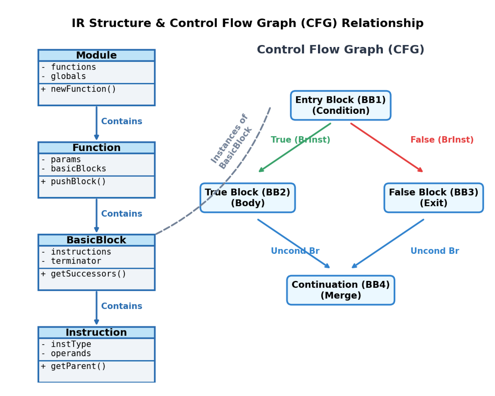
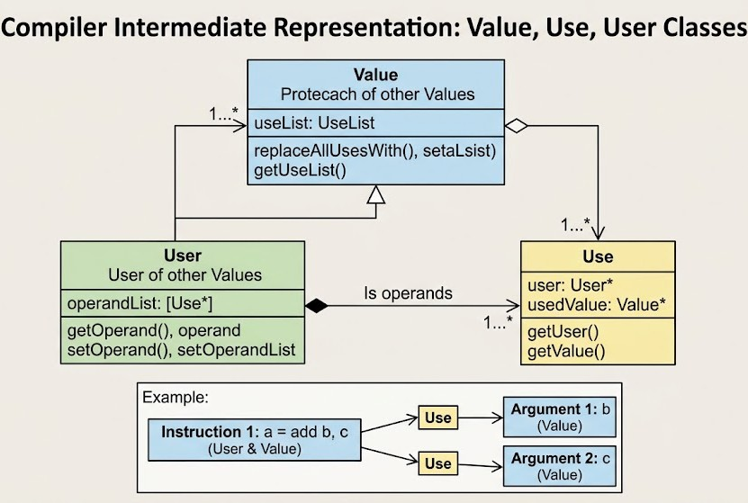

# TASK2 Q1

`yacc/`通过词分析和语法分析输入的`.sy`源代码文件转化为 AST ，然后 `lib/`遍历前端生成的 AST 并将其 **降级 (Lower)** 为初始的内存 IR 数据结构(`ModuleIR`)。这部分工作主要由`IRGenerator`完成。整个过程分为三步遍历：

1. **扫描函数声明(FuncDef)建立符号表**
2. **生成全局对象(VarDecl & ConstDecl)**
3. **解析函数体**

在扫描具体代码时也有三个步骤：

1. **创建函数骨架 (FuncDef & FuncParam)**
2. **生成函数体 (Block -> AssignStmt)**
3. **生成返回指令 (RetInst)**。

这个过程依赖以下三大板块：**TypeSystem（类型系统）**、**BaseManager（Value/Use 体系）** 和 **CFG（控制流体系）**。

---

## 1. TypeSystem

在生成任何一个变量、函数或指令之前，必须先用`TypeSystem`确定它的类型属性。`TypeSystem`通过维护的 **静态表(Cache)** 将一个前端抽象表示转化为中端具体类型。值得一提的是`TypeSystem`不仅停留在中端，还会通过`Target.cpp`里的`DataLayout`延伸到后端，计算真实的对齐和字节大小。

### 1.1 实现方式

* **以 IRType 作为抽象基类** ，向下派生出表示具体类型的子类，包括 INTType（整型）、FLOATType（浮点型）、VOIDType（空类型）、POINTERType（指针类型）和 ARRAYType（数组类型）。

* 内部使用 **静态的缓存哈希表（Cache/Map）** 来存储已创建的类型实例。

### 1.2 设计模式

* **享元模式 (Flyweight Pattern)** ：通过私有化或受保护的构造函数，强制外部只能通过静态工厂方法（如`INTType::get()`或`POINTERType::NewPointer()`）来获取类型实例。当请求某个类型时，系统会先检查缓存，若已存在则直接复用旧对象，从而避免内存浪费并极大地加速了类型的等价性比较。

## 2. CFG

>控制流图（CFG，Control Flow Graph）是编译器中用于描述程序中所有执行路径及其流向的有向图结构。其主要作用是将复杂的代码跳转逻辑（如顺序执行、分支 if-else、循环 while）结构化为基本块（`BasicBlock`）和终结指令（`BrInst` 条件/无条件跳转、`RetInst` 返回）的组合：条件分支可以有两个后继（也允许两条边指向同一个后继），块首则由若干 `PhiInst` 汇聚各条入边的值，为后续的程序分析和优化（如支配树计算、循环优化）提供统一的骨架支撑。

## 3. BaseManager

>BaseManager（更准确地说是其中的`Value/Use/User`体系）是整个 LLVM IR 中端数据结构的核心，它通过双向链表和基类派生，用于建立和维护程序中所有 Value 和 User 之间的`Def-Use`链。其核心作用是在初始阶段记录好严密的数据依赖关系，从而为后续中端进行各种优化（如消除冗余、移动循环不变量）提供瞬时查询和修改数据流的能力。

