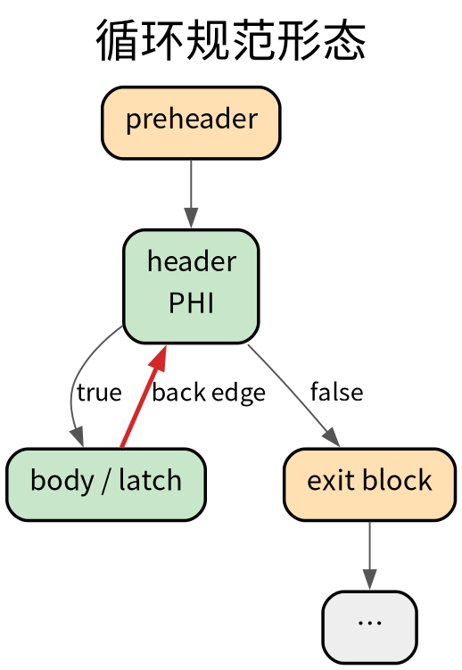
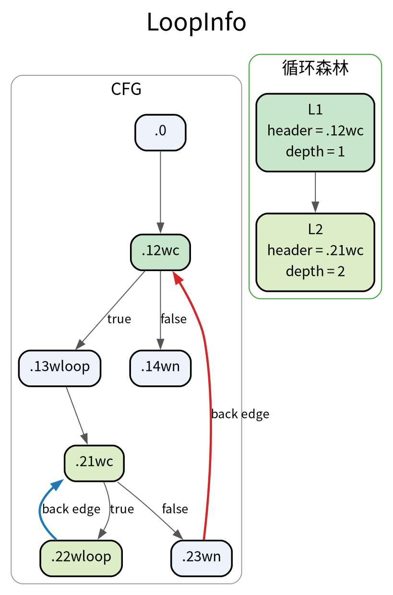
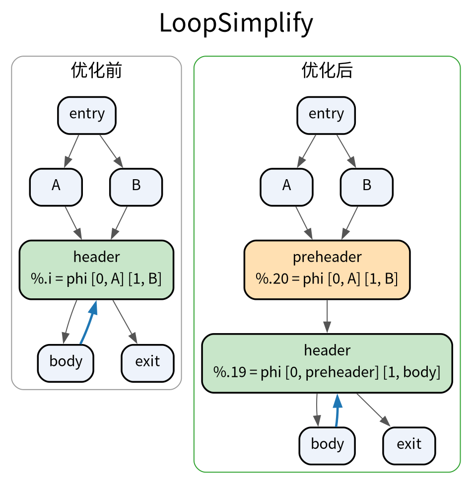
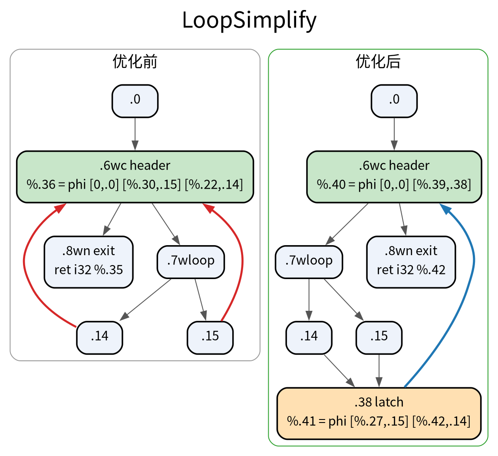
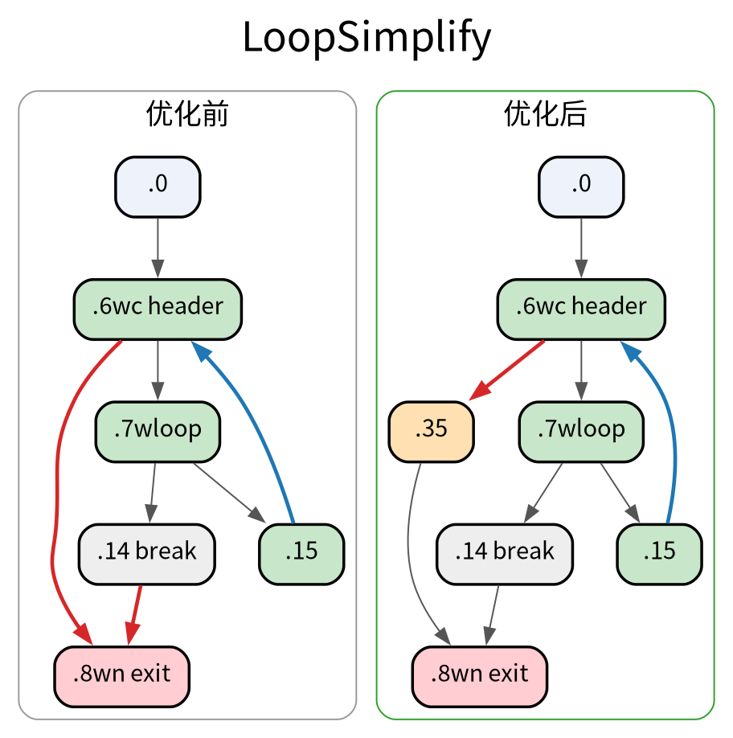
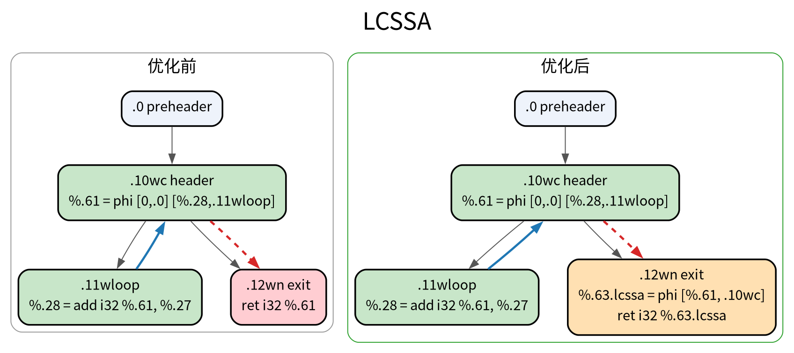
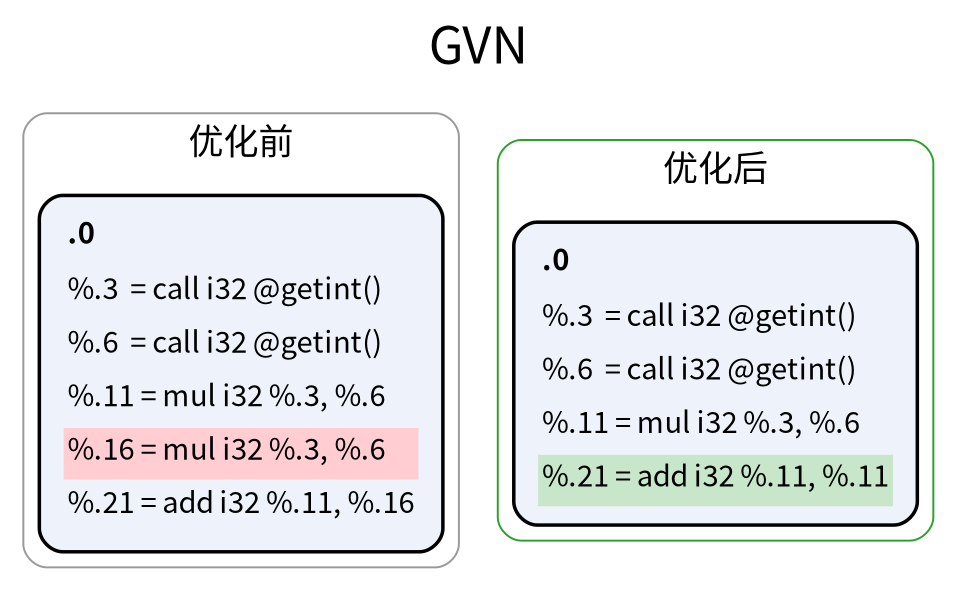
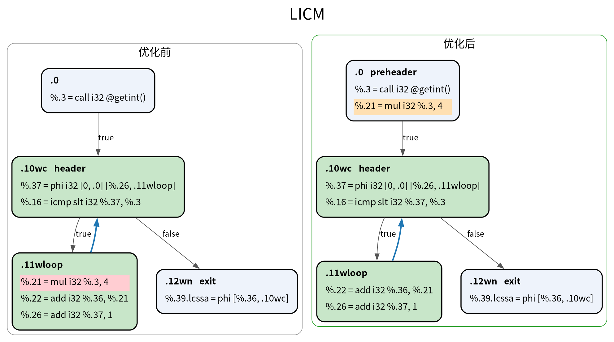

# TASK2 Q4

## 一、循环规范

**循环规范形态（canonical loop form）** 就是把自然循环整理成三个固定性质：

1. **唯一预头`preheader`**：循环头在循环外只有一个前驱，且该前驱只通向循环头。它给「要移出循环的指令」提供了唯一、且必然被执行的落点。
2. **唯一锁存块`latch`**：回到循环头的回边只有一个来源块。循环头的 PHI 形状因此固定，回边携带的递推值只有一个来源。
3. **专用出口`dedicated exit`**：循环的每个出口块，前驱全部来自循环内部，不再有循环外的块直接跳入。这样「循环退出」与循环外的控制流完全隔离。

*图中橙色块为该 pass 新建的基本块；加粗彩色的边表示本图关注的控制流边，其余为普通边。*

---

### 1.1 `LoopInfo`：识别循环结构

`LoopInfo` 是 `ir/analysis` 中的 AnalysisPass，负责把 CFG 上隐含的循环结构显式建模成**循环森林**：每个 `Loop` 记录自己的循环头 `Header`、直接属于本层的基本块 `Blocks`（不含子循环的块）、父子嵌套 `ParentLoop` / `SubLoops`，以及所有回边来源 `BackedgeSrcs`。

---

### 1.2 `LoopSimplify`：改造规范形态

**1. 插入唯一预头：** 若循环头拥有多个循环外前驱，则新建一个合并块，把全部循环外入口都改道指向它，并让它的头部 PHI 用桥接 PHI 把原来每条入口边携带的值合并成一条，再由该块无条件跳转到循环头。

**2. 合并多回边为唯一锁存块:** 若循环头拥有多个循环内前驱，则新建唯一锁存块，把所有回边源先汇入它，并为循环头重建只含「入口值 + 锁存块递推值」两项的 PHI。

**3. 拆出专用出口：** 若某个出口块同时被循环内和循环外的块进入，则在出口块前插入一个中转块，把循环内的退出边改为先经过它，出口块因此只被循环内部进入。

---

### 1.3 `LCSSA`：封闭循环内定义在循环外的使用

若一个值定义在循环体内、却在循环外被使用，那么这条`use-def`边就穿过了循环边界。任何想在循环上做代码移动的优化都要处理这些特例。

`LCSSA`**不改变控制流，只改变数据流**。做法是：在每个出口块中为这类值插入一个 `LCSSA PHI`，把「循环内定义 → 循环外使用」的跨界关系统一收敛成「定义 → 出口 PHI → 循环外使用」

---

## 二、GVN & LICM

### 2.1 `LocalGVN`：块内值编号

**块内公共子表达式消除**:每个基本块维护一张「表达式 → 代表值」的表，键为「操作码 + 两个操作数」。因为 IR 已是 SSA，操作数本身就是其值的唯一代表，键相同即表达式相同。命中时把重复指令的全部使用者改指代表值，再删除该指令。可交换的运算（加、乘、与、或、异或、等于、不等）在入表前把两个操作数按固定顺序排列，使 `a+b` 与 `b+a` 命中同一个键；减与比较的大小关系不可交换，顺序保留。

---

### 2.2 `LICM`：循环不变量外提

按后序遍历循环，用 `LoopInfo::getLoopSimplifyForm` 取唯一`preheader`，把「每个操作数都循环不变」的整数运算搬到`preheader`，只在循环外算一次。可外提的指令必须无副作用且不会陷入，否则不能无条件提前执行，因此除法、取模、访存与函数调用都不在范围内。一条指令外提后，以它为操作数的指令可能随之变成不变量，因此需要在同一循环内反复扫描直到不动点；处理嵌套循环时内层先外提，内层的结果还可能继续成为外层的不变量。

---

## 三、多面体编译优化

### 3.1 仿射变换

* 形如 `f(x) = A·x + b` 的映射：每个输出分量都是输入分量的线性组合再加上一个常数项，即「线性部分 + 平移」。

### 3.2 多面体循环优化

* **多面体优化**面向**循环嵌套且下标与边界都是循环变量仿射函数**的规则循环（静态控制部分：边界编译期可知、无指针间接、无提前退出）。它把语句的迭代空间建成整数多面体、把依赖关系建成仿射映射，再用整数线性规划求出一个满足全部依赖的调度，因此能做循环交换、倾斜、分块、融合、分裂与并行化，并且能证明某个循环层可以并行。

* **循环展开**是把循环体复制若干份、步长相应放大。它不改变迭代空间，只摊薄循环开销并把指令级并行暴露给后端调度，属于局部、语法级的变换；它不分析也不证明依赖关系。两者的差别在于所针对的循环类型：多面体要求循环足够规则、能被精确建模成整数多面体，换来的是重塑迭代空间并证明并行性的能力；展开对循环形状没有要求（不可静态分析的不规则循环也能展开），但无法把存在循环携带依赖的循环变成并行循环。

### 3.3 一个典型的多面体求解器实现

* **isl（Integer Set Library）**。它提供多面体与仿射映射的基本运算（并、交、投影、整数投影、字典序极值等，见 `isl_map.c`），并在 `isl_schedule_constraints.c` / `isl_scheduler.c` 中实现 Pluto 风格的调度算法，用整数线性规划求解满足依赖的调度；`isl_ast_build.c` 再把调度翻译成带循环结构的 AST。

* 它在编译器中的作用（以 LLVM 的 Polly 为例）：ScopInfo 识别出 SCoP 后，用 isl 的 set/map 表示迭代域与访存、用依赖信息构造调度约束，调用 `isl_schedule_constraints_compute_schedule` 解出满足所有依赖的调度，再由 `isl_ast_build_*` 生成循环 AST（clast），最后由 Polly 展开回 LLVM IR（可携带 OpenMP 并行域）。
