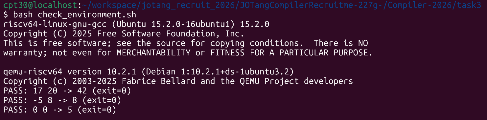
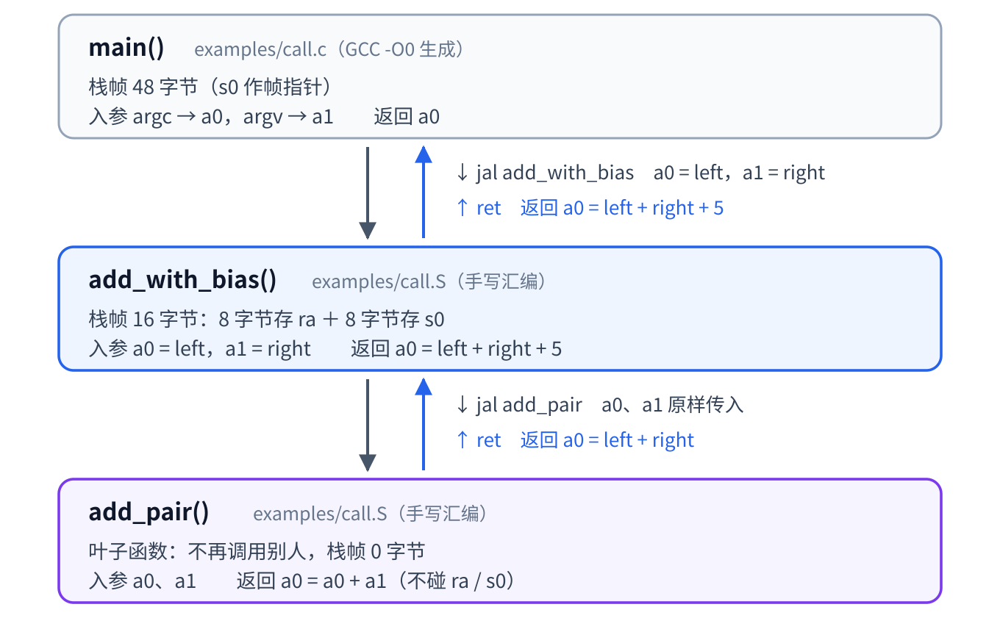
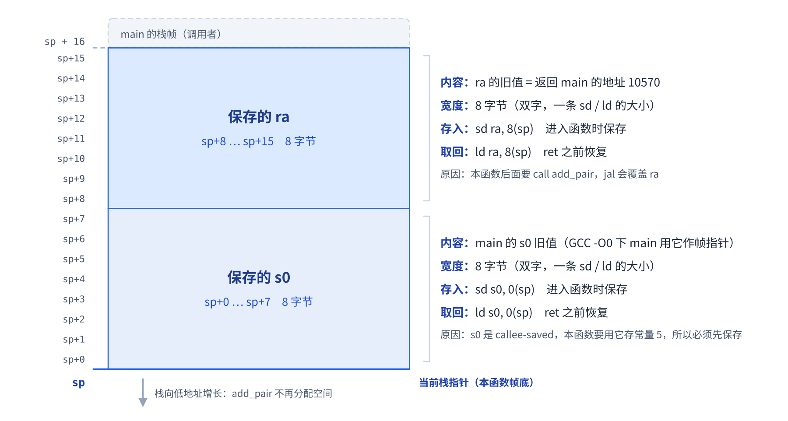
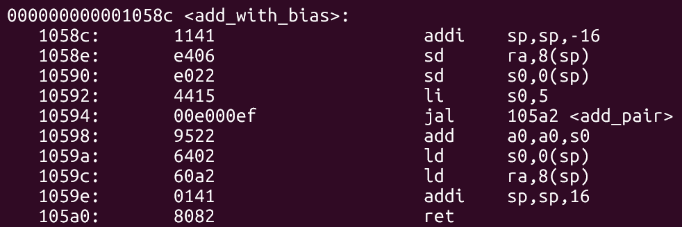
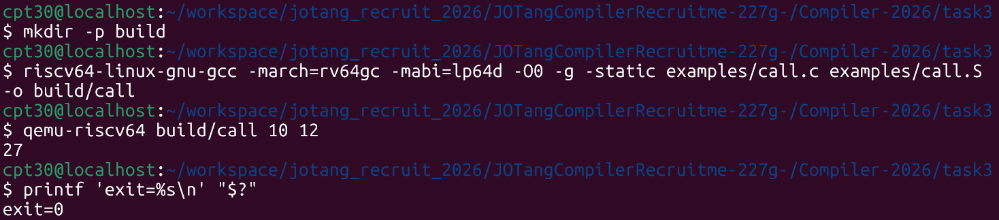
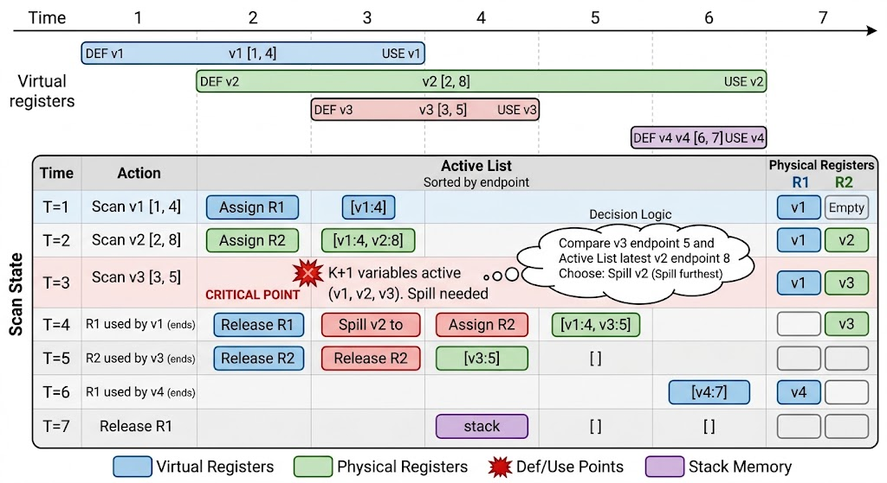
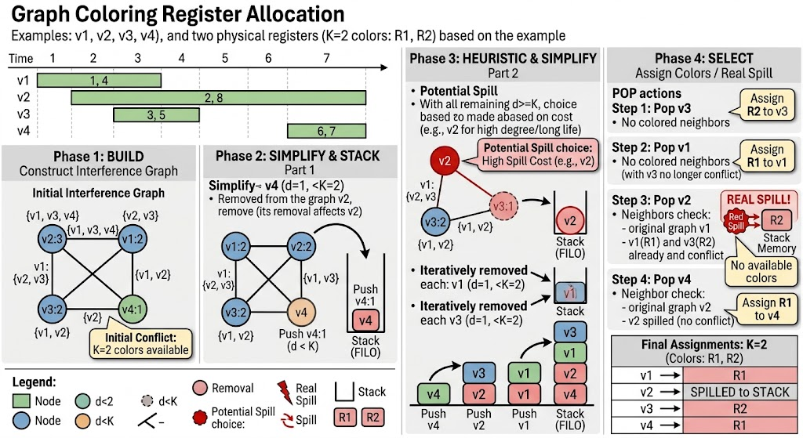

# task3：后端

## 1. 基础运行实验与配置环境

*工具版本、三组输出与退出码：*



---

## 2. 调用链与栈帧

* **调用链**：程序的执行流是从 main 函数开始，向下调用 add_with_bias 进行偏置计算，并在其内部进一步调用 add_pair 完成两个基础参数的相加。



* **栈帧**：为了在调用 add_pair 时不丢失原有状态，add_with_bias 在栈顶向下分配了 16 字节的空间，将返回地址（ra）保存在高 8 字节处，将被调用者保存寄存器（s0）保存在低 8 字节处。



---

## 3. 反汇编对照解释



* 参数与返回值存放：传入的两个参数分别存储在`a0`和`a1`寄存器中，函数的最终计算结果也通过`a0`寄存器向外返回。
* 为什么保存`ra`、`s0`：保存`ra`是为了防止内部调用`add_pair`时覆盖返回地址导致无法回到`main`，保存`s0`是因为本函数修改了该寄存器（赋值为5）故必须备份原值。
  >本例`s0`只是保存数据，实际上`s0`常用来保存帧指针`fp`，通过偏移量读取数据。
* `Caller-Saved`由调用者负责保存，如`ra`、`a0-a7`、`t0-t6`。`Callee-Saved`由被调用者负责保存，如`s0-s11`。
* 为什么栈帧分配16字节：函数需要将`ra`和`s0`两个 64 位（各 8 字节）的寄存器备份到栈上，总共 16 字节，同时也满足 RISC-V 要求栈指针必须 16 字节对齐的规范。
* 恢复顺序与`ret`作用：让每一条`ld`都在`sp`被移回之前取走自己帧里的数据。最后的`ret`指令负责读取恢复后的`ra`寄存器地址并无条件跳转回上一级函数。
* 伪指令与反汇编的区别：源码中的伪指令（如`call`）是汇编器提供给程序员的语法糖。在反汇编结果中会显示为 CPU 真正执行的底层基础指令（如`jal`）。

---

## 4. 独立输入验证

*独立输入：10, 12；手算结果：27（10 + 12 + 5）；实际输出 27，退出码`exit=0`，与预期一致。*



* 如果将存放常量 5 的寄存器从`s0`换成`caller-saved`寄存器（如`t0`），那么在执行`call add_pair`之前，当前函数（作为调用者）必须主动将 `t0` 的值压入栈中保存；并在 `add_pair` 返回后，再从栈中把值读出来恢复：

```assembly
add_with_bias:
    addi sp, sp, -16
    sd ra, 8(sp)
    sd s0, 0(sp)    -> li t0, 5
    li s0, 5        -> sd t0, 0(sp)
    call add_pair
    add a0, a0, s0  -> ld t0, 0(sp)
    ld s0, 0(sp)    -> add a0, a0, t0
    ld ra, 8(sp)
    addi sp, sp, 16
    ret
```

---

## 5. 寄存器分配

* **虚拟寄存器 (Virtual Register)**：编译器内部数据结构中的抽象符号标号（如 `%0`、`%1`），是中端假设存在的、数量无限的逻辑存储单元。

* **物理寄存器 (Physical Register)**：真实 CPU 硬件中数量严格有限的高速存储单元（如 RISC-V 的 32 个通用寄存器），用于程序运行时的实际数据存放。

* **活跃区间 (Live Interval)**：一个变量从首次被赋值（Def）到最后一次被读取使用（Use）所跨越的指令范围。

* **Spill (寄存器溢出)**：当同时活跃的变量数超过物理寄存器总量时，将部分变量临时存入内存（栈帧）以腾出空间的过程，会增加访存开销。

### 5.1 线性扫描

线性扫描是一种基于**贪心策略**的寄存器分配算法，按起始时间单向扫描，当寄存器不够用时，总是优先**把结束时间最晚的变量 Spill** 到内存。



1. 按起始时间先后扫描到`v1`和`v2`，依次为其分配空闲的物理寄存器`R1`和`R2`
2. 扫描到`v3`时发现物理寄存器已满，对比发现`v2`结束时间（8）晚于`v3`结束时间（5），因此将`v2` Spill 到栈内存，把`R2`分配给`v3`
3. `v1`和`v3`活跃区间结束，依次正常释放所占用的`R1`和`R2`
4. 扫描到`v4`，直接为其分配当前已重新空闲的物理寄存器`R1`

### 5.2 图着色

图着色是一种基于**全局生命周期冲突图**的寄存器分配算法，通过不断移除低冲突节点入栈，遇到高冲突时利用代价模型挑选节点作为潜在溢出，最后通过反向出栈进行无冲突着色来完成全局最优化的寄存器分配。



1. **构建图**：根据变量活跃区间的重叠情况，构建出反映`v1`、`v2`、`v3`、`v4`冲突关系的初始全局图
2. **简化入栈**：找出度数小于可用寄存器数（K=2）的低冲突节点（`v4`），将其从图中移除并压入分配栈的底部
3. **启发式溢出**：面对剩余节点度数均大于等于 K 的情况，基于代价挑选高冲突节点（`v2`）作为潜在溢出对象压栈，并继续把受此影响而度数降低的剩余节点（`v1`、`v3`）依次移除压栈
4. **出栈着色**：反向弹出栈内节点分配物理寄存器，成功为`v3`、`v1`、`v4`分配，而在弹出`v2`发现相邻节点已占满所有寄存器时，对其触发真正的内存溢出
